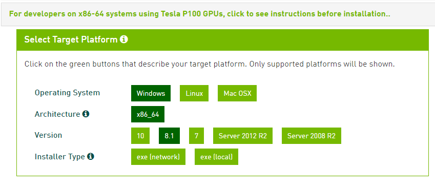
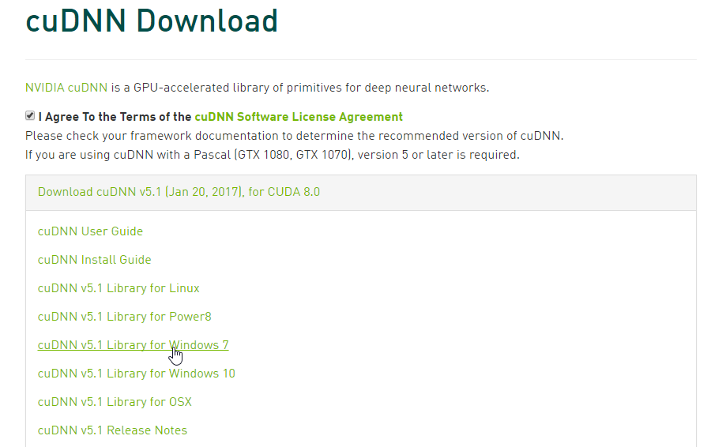
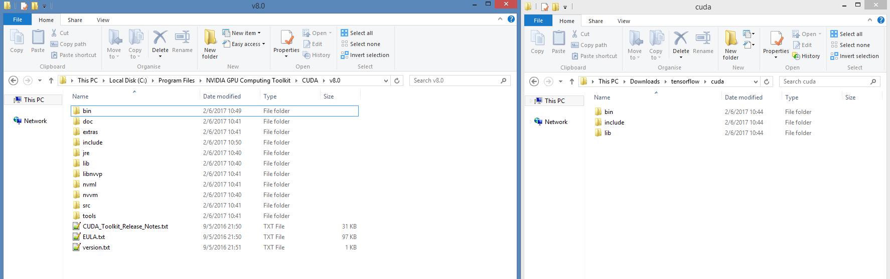

# Getting Started

To start with deep learning, you can choose either tensorflow, theano

# Tensorflow

## Install in Windows

In this section, I will introduce how to setup your tensorflow library working with GPU in Windows.

My environment is:

* Windows 8.1 Pro 64-bit
* Graphic Card: NVIDIA GeForce GTX 980

What are missing?

* Anaconda
* CUDA Toolkit 8.0 (cuda_8.0.44_windows.exe)
* CUDNN - CUDA for Deep Neural Networks (cudnn-8.0-windows7-x64-v5.1.zip)
* tensorflow package

### Anaconda

Anaconda is the leading open data science platform powered by Python. The open source version of Anaconda is a high performance distribution of Python and R and includes over 100 of the most popular Python, R and Scala packages for data science.

Step 1: Download the [Anaconda installer](http://continuum.io/downloads.html)

Step 2: Double click the Anaconda installer and follow the prompts to install to the default location.

After a successful installation you will see output like this:


### CUDA Toolkit 8.0

The NVIDIA CUDA Toolkit provides a comprehensive development environment for C and C++ developers building GPU-accelerated applications. The CUDA Toolkit includes a compiler for NVIDIA GPUs, math libraries, and tools for debugging and optimizing the performance of your applications. You’ll also find programming guides, user manuals, API reference, and other documentation to help you get started quickly accelerating your application with GPUs.

Step 1: Verify the system has a CUDA-capable GPU.

Step 2: Download the [NVIDIA CUDA Toolkit](http://developer.nvidia.com/cuda-downloads).

Step 3: Install the NVIDIA CUDA Toolkit.

Step 4: Test that the installed software runs correctly and communicates with the hardware.



### cuDNN

The NVIDIA CUDA Deep Neural Network library (cuDNN) is a GPU-accelerated library of primitives for deep neural networks. cuDNN provides highly tuned implementations for standard routines such as forward and backward convolution, pooling, normalization, and activation layers. cuDNN is part of the NVIDIA Deep Learning SDK.

Step 1: Register an NVIDIA developer account

Step 2: Download [cuDNN v5.1](https://developer.nvidia.com/cudnn), you will get file like that `cudnn-8.0-windows7-x64-v5.1.zip`



Step 3: Copy CUDNN files to CUDA install

Extract your `cudnn-8.0-windows7-x64-v5.1.zip` file, and copy files to corresponding CUDA folder

In my environment, CUDA installed in `C:\Program Files\NVIDIA GPU Computing Toolkit\CUDA\v8.0`, you must copy append three folders `bin`, `include`, `lib`



### Install Tensorflow Package

CPU TensorFlow environment

```
conda create --name tensorflow python=3.5
activate tensorflow
conda install -y jupyter scipy
pip install tensorflow
```

GPU TensorFlow environment

```
conda create --name tensorflow-gpu python=3.5
activate tensorflow-gpu
conda install -y jupyter scipy
pip install tensorflow-gpu
```

**References**

* Using TensorFlow in Windows with a GPU, [http://www.heatonresearch.com/2017/01/01/tensorflow-windows-gpu.html](http://www.heatonresearch.com/2017/01/01/tensorflow-windows-gpu.html)
* sentdex, Installing CPU and GPU TensorFlow on Windows, [https://www.youtube.com/watch?v=r7-WPbx8VuY](https://www.youtube.com/watch?v=r7-WPbx8VuY)
## word2vec Example

Step 1: Download word2vec example from [github](https://github.com/tensorflow/tensorflow/blob/master/tensorflow/examples/tutorials/word2vec/word2vec_basic.py)

```
$ dir

02/06/2017  11:45    <DIR>          .
02/06/2017  11:45    <DIR>          ..
02/06/2017  10:12             9,144 word2vec_basic.py
```

Step 2: Run `word2vec_basic` example

```
$ activate tensorflow-gpu
$ python word2vec_basic.py

Found and verified text8.zip
Data size 17005207
Most common words (+UNK) [['UNK', 418391], ('the', 1061396), ('of', 593677), ('and', 416629), ('one', 411764)]
Sample data [5241, 3082, 12, 6, 195, 2, 3136, 46, 59, 156] ['anarchism', 'originated', 'as', 'a', 'term', 'of', 'abuse', 'first', 'used', 'against']
3082 originated -> 5241 anarchism
3082 originated -> 12 as
12 as -> 6 a
12 as -> 3082 originated
6 a -> 195 term
6 a -> 12 as
195 term -> 2 of
195 term -> 6 a
Initialized
Average loss at step  0 :  288.173675537
Nearest to its: nasl, tinkering, derivational, yachts, emigrated, fatalism, kingston, kochi,
Nearest to into: streetcars, neglecting, deutschlands, lecture, realignment, bligh, donau, medalists,
Nearest to state: canterbury, exceptions, disaffection, crete, westernmost, earthly, organize, richland,
...
```


